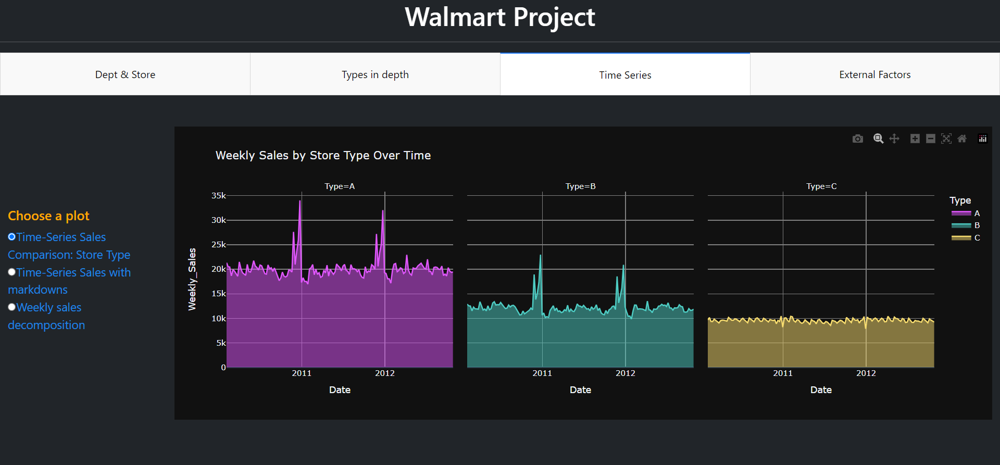

# Walmart Sales Forecasting 🛍️

**Description:** As one of the leading retail giants in the US, Walmart aims to accurately predict sales and demand. Events and holidays can affect daily sales. With 45 Walmart stores' sales data at hand, the challenge is dealing with unforeseen demands and stockouts due to less-than-optimal machine learning models. An ideal model should account for economic indicators like the CPI and Unemployment Index.

Prominent holidays like the Super Bowl, Labour Day, Thanksgiving, and Christmas affect sales. In the evaluation, holiday weeks are given 5x weightage. Part of this challenge is factoring in the effects of promotional markdown events, especially during these holiday weeks, despite incomplete historical data.

**Acknowledgements:** The dataset originates from [Kaggle](https://www.kaggle.com/datasets/yasserh/walmart-dataset).

## 🚀 Project Phases:
1. EDA and statistical analysis
2. Time Series Predictive modeling (Future Phase)

**Dashboard Sample:** 

---

# Insights:

## 📊 Walmart Store Insights

### Comparative Analysis:

| Features         | Supercenter                                              | Discount Store                                | Neighborhood Market                               |
|------------------|----------------------------------------------------------|------------------------------------------------|--------------------------------------------------|
| **Founded In**   | 1988                                                     | 1962                                           | 1998                                               |
| **Size**         | 182,000 sq ft                                            | 106,000 sq ft                                  | 38,000 sq ft                                       |
| **Key Products** | Grocery, electronics, apparel, home decor, fresh produce | Electronics, apparel, home decor, health/beauty| Pharmacy, groceries, fresh produce, dairy, bakery |
| **Unique Features**| 24/7 ops; Potential for banks, salons, etc.           | Spacious, well-lit ambiance                   | -                                                  |

_[Source](https://corporate.walmart.com/about)_

From analyzing the sizes of the stores, I concluded that
- 🅰️ Supercenter
- 🅱️ Discount Store
- 🅲️ Neighborhood Market

### Deep Dive Insights:
- 🌟 Dept 72 peaks during holidays; Dept 92 leads during non-holidays.
- For 🅱️, Dept 38 dominates non-holiday sales.
- 🅲️: Dept 92 is the holiday sales leader.
- 📉 Dept 78 consistently records the lowest sales.

### Store Performance:
- 🌟 Top Stores: 20, 4, 14, 10, 2, 13.
- Super Bowl Stars: Stores 20, 4
- Labor Day Stars: Stores 14, 20
- 📉 Lowest sales from Stores 33 & 5.

## 📊 Walmart Store Types Insights:
<h5> 🏪 Store Type Distribution

- **Type A Stores**: 💼 
    - Composition: 51.2% 
    - Average Weekly Sales Contribution: 48%

- **Type B Stores**: 🎒 
    - Composition: 38.7% 
    - Average Weekly Sales Contribution: 29.3%

- **Type C Stores**: 📦 
    - Composition: 10.1%
    - Average Weekly Sales Contribution: 22.7%
    - Type C, with 23% sales, sees a dip to 17% on Thanksgiving. However, this performance is still significant compared to the 10.1% of other store types.

## 📊 Walmart Time Series Insights:
- **Seasonal Trends**:
  - Types A & B experience noticeable sales spikes in November and December, unlike Type C.
  - Sales drop for Types A and B in January due to prior heavy spending during the holidays. Sales rebound in February due to events like Groundhog Day, Valentine's Day, etc. The trend also reflects in October as customers anticipate holiday deals in November and December.

- **Economic Observations**:
  - Over time, there's a noticeable rise in the CPI, indicating increasing inflation.
  - Concurrently, unemployment rates have been on the decline.
  - The pronounced inverse relationship between CPI and unemployment supports the principles of the Phillips Curve when assessed on a weekly basis.
  - A significant direct correlation is observed between fuel prices and CPI within the same weekly timeframe.
  - Conversely, fuel prices and unemployment display a marked inverse correlation weekly.
  - While the correlation between sales and other economic factors is relatively mild on a weekly basis, these relationships strengthen when evaluated monthly.

- **Difference in Means (With Markdowns - Without Markdowns**):
  - Temperature     1.535219
  - Fuel_Price      0.160912
  - CPI             4.436657
  - Unemployment   -0.745140

- **Promotions & Sales**:
  - At a glance, markdowns may seem ineffectual or even counterproductive. However, that period experienced higher inflation rate than the not markdown period.

- **Economic Events Influence**:
  - Other factors, such as the 2012 US presidential election, the Great Recession from 2008 to 2012, and the real estate crisis, affected sales. While sales marginally increased, they were effective given these unprecedented challenges.

---

# 🛒 Clustering Analysis

## Stores Analysis

**Cluster 0:**  
- **Number of Stores:** 12 out of 45
- **List of Stores:** [1, 2, 4, 6, 8, 10, 11, 13, 14, 20, 31, 39]
- **Comparative Analysis:**
  - Highest sales: 8.836126e+07
  - Highest amount of markdowns
  - Second highest CPI
  - Lowest unemployment rate

**Cluster 1:**  
- **Number of Stores:** 20 out of 45
- **List of Stores:** [7, 15, 16, 17, 18, 19, 22, 23, 24, 25, 26, 27, 29, 32, 34, 35, 40, 41, 44, 45]
- **Comparative Analysis:**
  - Second highest sales: 5.005106e+07
  - Second highest ranking in other economic indicators

**Cluster 2:**  
- **Number of Stores:** 5 out of 45
- **List of Stores:** [12, 28, 33, 38, 42]
- **Comparative Analysis:**
  - Sales: 3.706061e+07
  - Highest Fuel Price and unemployment rates

**Cluster 3:**  
- **Number of Stores:** 8 out of 45
- **List of Stores:** [3, 5, 9, 21, 30, 36, 37, 43]
- **Comparative Analysis:**
  - Lowest sales: 2.538583e+07
  - Lowest amount of markdowns
  - Highest CPI rate

---

## 🛒 Departments Analysis

**Cluster 0:**  
- **Number of Departments:** 22 out of 81
- **List of Departments:** [38, 40, 67, 72, 74, 79, 80, 81, 82, 83, 85, 87, 90, 91, 92, 93, 94, 95, 96, 97, 98, 99]
- **Comparative Analysis:**
  - Highest sales: 6.078312e+07
  - Least amount of markdowns
  - Represents the majority of the departments in Walmart
  - Highest CPI

**Cluster 1:**  
- **Number of Departments:** 4 out of 81
- **List of Departments:** [43, 65, 77, 78]
- **Comparative Analysis:**
  - Lowest sales: 5.724148e+05
  - Highest amount of markdowns
  - Highest unemployment rates

**Cluster 2:**  
- **Number of Departments:** 55 out of 81
- **List of Departments:** [1-14, 16-20, 21-31, 32-37, 39, 41, 42, 44-52, 54, 55, 56, 58, 59, 60, 71]
- **Comparative Analysis:**
  - Sales: On average, 2.018596e+07
  - Similar economic indicators as Cluster 0

**General Note:**  
- Fuel Price is consistent across all three clusters.
